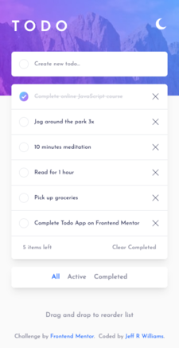
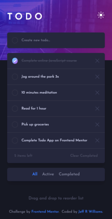
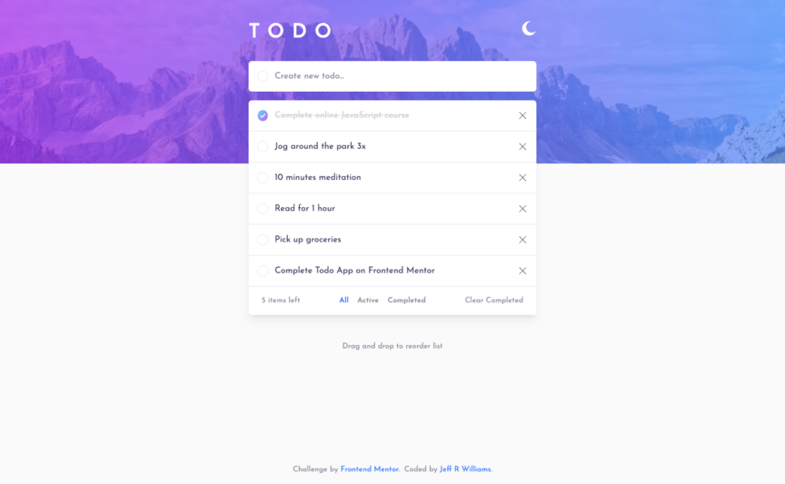
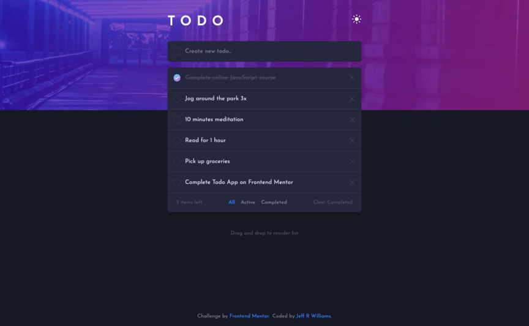

# Frontend Mentor - Todo app solution

This is a solution to the [Todo app challenge on Frontend Mentor](https://www.frontendmentor.io/challenges/todo-app-Su1_KokOW). Frontend Mentor challenges help you improve your coding skills by building realistic projects.

## Table of contents

- [The challenge](#the-challenge)
- [Screenshot](#screenshot)
- [Links](#links)
- [Built with](#built-with)
- [Author](#author)

### The challenge

Users should be able to:

- View the optimal layout for the app depending on their device's screen size
- See hover states for all interactive elements on the page
- Add new todos to the list
- Mark todos as complete
- Delete todos from the list
- Filter by all/active/complete todos
- Clear all completed todos
- Toggle light and dark mode
- **Bonus**: Drag and drop to reorder items on the list

### Screenshot

### Links

- Solution URL: [GitHub Repo](https://github.com/orphandeity/todo-app.git)
- Live Site URL: [GitHub Pages](https://orphandeity.github.io/todo-app/)

### Built with

- [React](https://reactjs.org/) - JS library
- [Vite](https://vitejs.dev/) - Frontend Tooling
- [TailwindCSS](https://tailwindcss.com/) - For styles

## Author

- GitHub - [orphandeity](https://github.com/orphandeity)
- Frontend Mentor - [@orphandeity](https://www.frontendmentor.io/profile/orphandeity)
